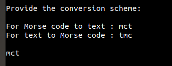
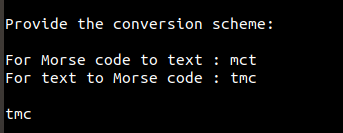

# Morse_code_encoder_decoder

This program encodes the following characters: letters (A to Z), digits(0-9) and punctuation symbols (, . ? : - ' " ( ) = + X @ ;) to Morse code.

It can also decodes the Morse code of the above characters back to the plain text.

It first asks the user to select the conversion scheme: from Text to Morse or Morse to text.

The program then reads the user input.

Then performs the selected conversion on the input string.

![Screenshot]

